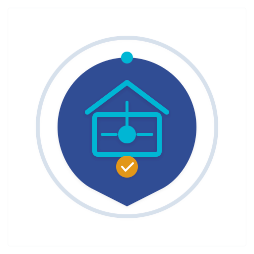

# LocaPlus - Plateforme Multi-Services



**LocaPlus** est une plateforme professionnelle multi-services qui met en relation les propriétaires, vendeurs de véhicules, vendeurs de matériaux de construction et techniciens avec des clients à la recherche de ces services.

## 🚀 Fonctionnalités

### Catégories disponibles
- **Immobilier** : Terrains, villas, appartements, bureaux, magasins (vente/location)
- **Véhicules** : Voitures, motos, trucks (vente/location)
- **Matériaux de construction** : Ciment, sable, gravier, fer, briques, bois, peinture
- **Techniciens** : Plombiers, électriciens, maçons, peintres, carreleurs, mécaniciens

### Fonctionnalités principales
- 🔐 **Authentification sécurisée** (JWT, bcrypt)
- 📝 **Création d'annonces** avec formulaires dynamiques par catégorie
- 🖼️ **Upload d'images** pour les annonces
- 💳 **Système de paiement** (Wave, Orange Money, MTN, Moov, Cartes bancaires)
- 📊 **Dashboard utilisateur** pour gérer ses annonces
- 📱 **Design responsive** (mobile-first)
- 🔒 **Sécurité** (Helmet, Rate Limiting, XSS protection)

## 🛠️ Technologies

### Backend
- **Node.js** + **Express.js**
- **PostgreSQL** (base de données)
- **bcryptjs** (hachage de mots de passe)
- **jsonwebtoken** (JWT)
- **multer** (upload de fichiers)
- **helmet** + **express-rate-limit** (sécurité)

### Frontend
- **React.js 18** + **Vite 5**
- **React Router DOM 6** (routing)
- **Axios** (requêtes HTTP)
- **CSS moderne** (variables, flexbox, grid)

## 📦 Installation

### Prérequis
- Node.js 18+
- PostgreSQL 14+

### 1. Cloner le projet

```bash
cd "mon App"
```

### 2. Configuration de la base de données

Assurez-vous que PostgreSQL est installé et en cours d'exécution. Créez une base de données :

```sql
CREATE DATABASE locaplus;
```

### 3. Configuration du Backend

```bash
cd backend
npm install
```

Créez le fichier `.env` dans le dossier `backend` :

```env
# Server
PORT=5000
NODE_ENV=development

# Database
DB_HOST=localhost
DB_PORT=5432
DB_NAME=locaplus
DB_USER=postgres
DB_PASSWORD=votre_mot_de_passe

# JWT
JWT_SECRET=votre_secret_jwt_tres_securise
JWT_EXPIRES_IN=24h
```

Lancez le serveur :

```bash
npm run dev
```

Le backend sera disponible sur `http://localhost:5000`

### 4. Configuration du Frontend

```bash
cd front-end
npm install
```

Lancez le frontend :

```bash
npm run dev
```

Le frontend sera disponible sur `http://localhost:5173`

## 📁 Structure du projet

```
mon App/
├── backend/
│   ├── config/
│   │   └── db.js          # Connexion PostgreSQL
│   ├── middleware/
│   │   ├── auth.js        # Authentification JWT
│   │   └── validation.js  # Validation des entrées
│   ├── routes/
│   │   ├── auth.js        # Routes auth (register, login)
│   │   ├── announcements.js # Routes annonces
│   │   ├── payments.js    # Routes paiements
│   │   └── contact.js     # Routes contact
│   ├── .env               # Variables d'environnement
│   ├── package.json
│   └── server.js          # Point d'entrée
│
├── front-end/
│   ├── src/
│   │   ├── assets/
│   │   │   └── logo.svg   # Logo LocaPlus
│   │   ├── components/
│   │   │   ├── Navbar.jsx
│   │   │   ├── Footer.jsx
│   │   │   └── ProtectedRoute.jsx
│   │   ├── context/
│   │   │   └── AuthContext.jsx
│   │   ├── pages/
│   │   │   ├── Home.jsx
│   │   │   ├── Announcements.jsx
│   │   │   ├── AnnouncementDetail.jsx
│   │   │   ├── Login.jsx
│   │   │   ├── Register.jsx
│   │   │   ├── CreateAnnouncement.jsx
│   │   │   ├── Dashboard.jsx
│   │   │   ├── Help.jsx
│   │   │   └── Contact.jsx
│   │   ├── services/
│   │   │   └── api.js
│   │   ├── styles/
│   │   │   └── index.css
│   │   ├── App.jsx
│   │   └── main.jsx
│   ├── index.html
│   ├── package.json
│   └── vite.config.js
│
└── README.md
```

## 🔌 API Endpoints

### Authentification
| Méthode | Endpoint | Description |
|---------|----------|-------------|
| POST | `/api/auth/register` | Inscription utilisateur |
| POST | `/api/auth/login` | Connexion utilisateur |
| GET | `/api/auth/profile` | Profil utilisateur (authentifié) |

### Annonces
| Méthode | Endpoint | Description |
|---------|----------|-------------|
| GET | `/api/announcements` | Liste des annonces (avec filtres) |
| GET | `/api/announcements/:id` | Détail d'une annonce |
| POST | `/api/announcements` | Créer une annonce (authentifié) |
| PUT | `/api/announcements/:id` | Modifier une annonce (authentifié) |
| DELETE | `/api/announcements/:id` | Supprimer une annonce (authentifié) |
| GET | `/api/announcements/my` | Mes annonces (authentifié) |

### Paiements
| Méthode | Endpoint | Description |
|---------|----------|-------------|
| GET | `/api/payments/methods` | Modes de paiement disponibles |
| POST | `/api/payments` | Créer un paiement |
| GET | `/api/payments/history` | Historique des paiements |

### Contact
| Méthode | Endpoint | Description |
|---------|----------|-------------|
| POST | `/api/contact` | Envoyer un message |

## 💰 Tarifs des annonces

| Catégorie | Prix/mois |
|-----------|-----------|
| Immobilier | 5 000 XOF |
| Véhicule | 4 000 XOF |
| Matériaux | 3 000 XOF |
| Technicien | 2 000 XOF |

## 🔒 Sécurité

- ✅ Hachage des mots de passe avec bcrypt (12 rounds)
- ✅ Tokens JWT avec expiration 24h
- ✅ Protection XSS et headers sécurisés (Helmet)
- ✅ Rate limiting (100 requêtes/15min)
- ✅ Validation et assainissement des entrées
- ✅ CORS configuré

## 📱 Design

Couleurs principales :
- **Bleu foncé** : `#1E3A5F` (primary)
- **Orange** : `#FF6B35` (accent)
- **Blanc** : `#FFFFFF` (secondary)

Le design est moderne, épuré et responsive (mobile-first).

## 📄 Licence

MIT License - Voir le fichier LICENSE pour plus de détails.

---

Développé avec ❤️ par LocaPlus